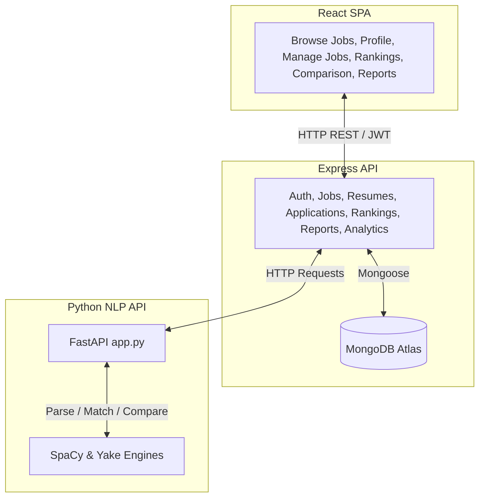

# AI-Based Candidate Evaluation System

An advanced, intelligent applicant tracking and candidate evaluation system (ATS) that parses resumes, matches candidates to job descriptions using NLP, aggregates analytics, and produces side-by-side AI comparisons and exportable PDF evaluation reports.

---

## 🏗️ Architecture & Logic Flow

This project is built as a multi-service web application comprising a React single-page app, a Node.js/Express REST API, and a Python FastAPI NLP microservice.



---

## 🌟 Core Features

### 👤 For Candidates
- **AI Resume Upload**: Upload resumes in PDF, DOCX, or TXT formats.
- **AI Profile Parser**: Dynamically extract candidate name, contact info, locations, skills tag cloud, education degrees, and years of experience.
- **Interactive Job Search**: Explore active postings and submit applications with a single click.

### 🏢 For Recruiters
- **Job Posting Management**: Create job openings with specific required skills, minimum experience, and required education level.
- **Automated Candidate Rankings**: Sort applicants automatically based on a weighted 4-factor scoring model:
  - **Skill match (40%)**: Overlap between candidate skills and required skills.
  - **Experience score (25%)**: Candidate years relative to required experience.
  - **Education level match (15%)**: Satisfying credential criteria.
  - **Semantic keyword similarity (20%)**: NLP-driven cosine matching of resume text and description text.
- **ATS Analyzer & AI Insights**: View detailed breakdowns of missing skills, strengths, weaknesses, and ATS optimization grades ($A^+$, $A$, $B$, etc.).
- **Side-by-Side Candidate Comparison**: Run side-by-side comparisons of any two applicants to contrast scores, check competitive advantages, and read final hiring recommendations.
- **PDF Report Generation**: Auto-compile and download official PDF evaluation reports for any posting.
- **Visual Analytics Dashboard**: View charts tracking ATS score distributions, in-demand skills, and recommendation ratios.

---

## 💻 Tech Stack

- **Frontend**: React (v19), Vite, Tailwind CSS v4, Axios, Recharts (Charts), React Icons, React Hot Toast.
- **Backend API**: Node.js, Express, MongoDB (Mongoose), JWT Auth, Multer (File uploads), PDFKit (PDF generation).
- **AI Microservice**: Python, FastAPI, Uvicorn, SpaCy (Named Entity Recognition), Yake (Keyword extraction), PyPDF, Python-docx.

---

## 📁 Project Structure

```
├── ai-service/               # Python NLP/AI Service
│   ├── utils/                # Regex and heuristic information extractors
│   ├── app.py                # FastAPI endpoints
│   ├── ats_engine.py         # ATS grading calculations
│   ├── comparison.py         # Side-by-side advantage comparative logic
│   ├── explainability.py     # Strengths and weaknesses generators
│   └── extractor.py          # SpaCy NER & Yake keyword parser
├── client/                   # React/Vite Frontend
│   ├── src/
│   │   ├── components/       # Layout, Sidebars, and UI cards
│   │   ├── context/          # React Auth Context
│   │   ├── pages/            # App screens (Candidate, Recruiter, Admin views)
│   │   ├── routes/           # Protected routes and routing engine
│   │   ├── services/         # Axios API connection layers
│   │   └── main.jsx / App.jsx
└── server/                   # Node.js/Express Backend REST API
    ├── src/
    │   ├── config/           # MongoDB connection & Cloudinary setup
    │   ├── controllers/      # Route logic handlers (auth, applications, rankings, reports, etc.)
    │   ├── middleware/       # JWT auth, role validation, file upload configs
    │   ├── models/           # Mongoose schemas (User, Resume, JobDescription, Application, Ranking, Report)
    │   ├── services/         # API wrappers for AI microservice and PDF generators
    │   └── app.js / server.js
```

---

## 🚀 Setup & Running Instructions

### Prerequisites
- Node.js (v18+)
- Python (v3.9+)
- MongoDB connection URI (configured in backend `.env`)

### 1. Run the AI Microservice (Python)
Navigate to the `ai-service` directory:
```bash
cd ai-service
```
Create a virtual environment and activate it:
```bash
python -m venv .venv
# On Windows:
.venv\Scripts\activate
# On macOS/Linux:
source .venv/bin/activate
```
Install dependencies:
```bash
pip install -r requirements.txt
```
Install the SpaCy NLP model:
```bash
python -m spacy download en_core_web_sm
```
Start the service (defaults to port `8000`):
```bash
uvicorn app:app --reload --port 8000
```

### 2. Run the Backend REST API (Node.js)
Navigate to the `server` directory:
```bash
cd ../server
```
Install dependencies:
```bash
npm install
```
Configure environment variables. Check that `server/.env` contains:
```env
PORT=5000
MONGO_URI=<your-mongodb-connection-string>
JWT_SECRET=<your-jwt-signing-secret>
AI_SERVICE_URL=http://localhost:8000
```
Start the API server in development mode:
```bash
npm run dev
```

### 3. Run the Frontend Client (React/Vite)
Navigate to the `client` directory:
```bash
cd ../client
```
Install dependencies:
```bash
npm install
```
Configure environment variables. Check that `client/src/.env` contains:
```env
VITE_API_URL=http://localhost:5000/api
```
Start the development server:
```bash
npm run dev
```

Open your browser and navigate to `http://localhost:5173` to explore the system!
